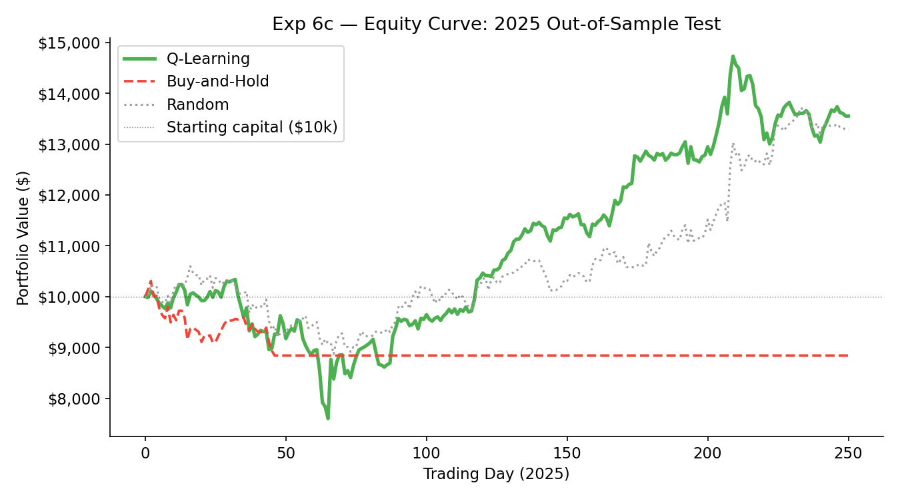
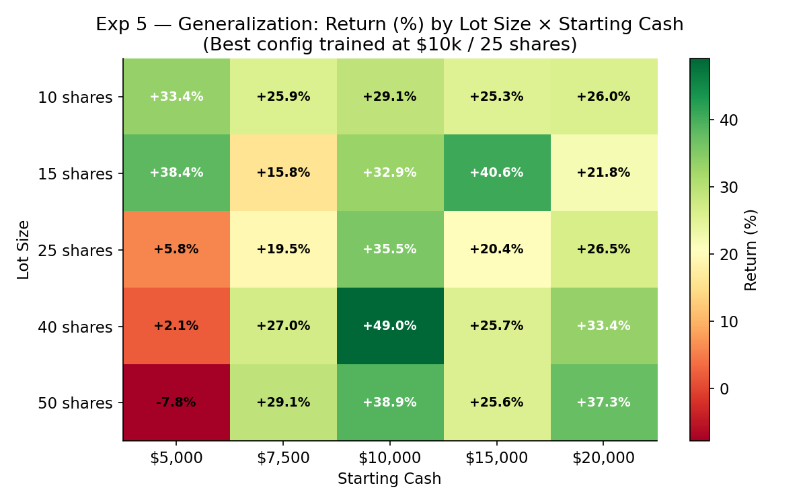
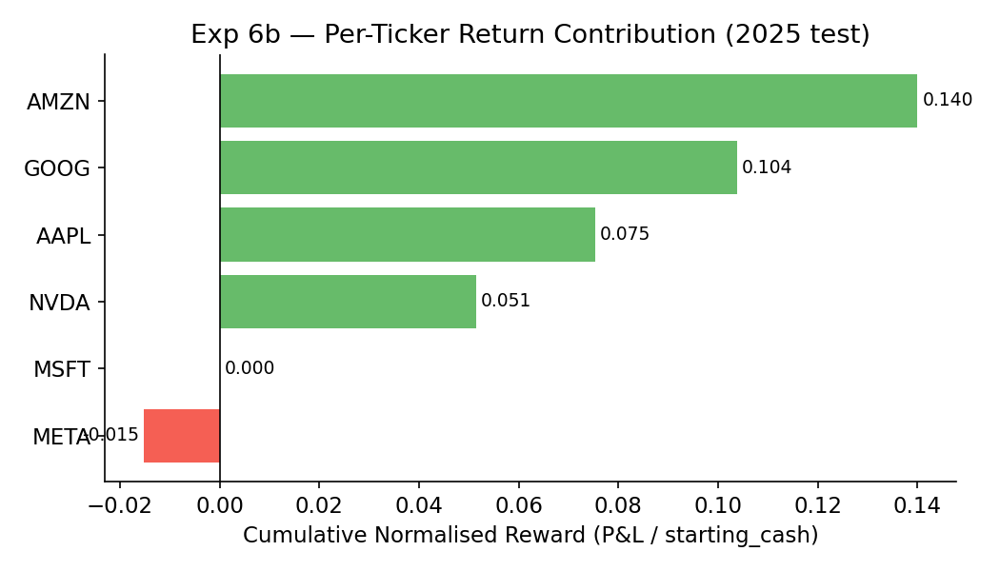

<div align="center">

# SignalScope

### Can publicly observable AI-adoption signals beat the market?

A tabular Q-learning agent trained on **Google Trends**, **SEC filing keyword density**,
and **price/volume momentum** — evaluated on a 6-stock tech portfolio in a fully out-of-sample 2025 backtest.

[](https://python.org)
[]()
[]()
[]()

<br/>



*Q-Learning (green) steadily outpaces Buy-and-Hold (red, liquidation-triggered flat) and Random (grey) throughout 2025 — a year tech buy-and-hold lost money.*

</div>

---

## Results

**2025 was a down year for tech.** Buy-and-hold lost 11.6% while the agent gained 45.1%, beating the benchmark by **+56.7 percentage points**.

<div align="center">

| | **Q-Learning** *(vol_only + DR)* | Random | Buy-and-Hold |
|:---|:---:|:---:|:---:|
| **Return** | **+45.1%** | +32.8% | -11.6% |
| **Final value** ($10k start) | **$14,506** | $13,280 | $8,841 |
| **Sharpe ratio** | **1.57** | 1.36 | -1.17 |
| **Max drawdown** | -26.2% | -16.3% | -14.2% |

*Training: 2020–2024 &nbsp;·&nbsp; Evaluation: 2025 out-of-sample (250 trading days)*

</div>

### Lot-sizing ablation *(2022–2024 eval set)*

Adding dynamic lot sizing on top of the base Q-learning policy consistently improves both return and risk-adjusted performance.

<div align="center">

| Config | Return | Sharpe | Max DD | vs Baseline |
|:---|:---:|:---:|:---:|:---:|
| Baseline — fixed lot, no DR | +40.5% | 1.38 | -13.4% | — |
| Confidence only | +62.0% | 1.95 | -13.0% | +21.5 pp |
| Volatility only | +69.5% | 1.88 | -19.6% | +29.0 pp |
| **Both — best risk-adjusted** | **+62.9%** | **1.98** | **-11.2%** | +22.4 pp |

</div>

<br/>

<table align="center">
  <tr>
    <td align="center" width="50%">
      
      <br/><em>Policy trained at $10k / 25 shares stays positive across<br/>nearly all lot-size × capital combinations</em>
    </td>
    <td align="center" width="50%">
      
      <br/><em>AMZN and GOOG drive the bulk of returns;<br/>META was the only net drag in 2025</em>
    </td>
  </tr>
</table>

<br/>

> Full experiment write-up: [`reports/signalscope_project_summary.pdf`](reports/signalscope_project_summary.pdf)  
> Detailed ablation tables: [`reports/docs/ablation_results.md`](reports/docs/ablation_results.md)

---

## How it Works

**Three public data sources, fully automated:**

| Source | Signal | Coverage |
|:---|:---|:---|
| yfinance | OHLCV prices | 2020–2025, 6 tickers |
| Google Trends (pytrends) | Weekly AI search interest | 2022–2025 |
| SEC EDGAR | AI keyword density in 10-K / 10-Q / 8-K filings | 2020–2025 |

**State space** — five signals per ticker per day, each bucketed into `low / medium / high` using training-period quantiles (no test-set leakage):

```
trend=X | volume=X | volatility=X | recent_return=X | sec_ai=X | lots=N
```

~1,200 unique states observed. The Q-table covers 99% of them after training.

**Environment** — one shared $10,000 cash account across all 6 tickers. Each day the agent issues a `BUY / HOLD / SELL` action per ticker (25-share lots, max 4 lots per ticker). Buying AAPL reduces cash available for AMZN.

**Reward** — `(shares × price × daily_return[t+1]) / starting_cash` — normalised dollar P&L, per-ticker credit assignment, next-day return avoids look-ahead bias.

**Risk controls** applied every step:

| Control | Trigger | Action |
|:---|:---|:---|
| Stop-loss | Price falls ≥ 10% below avg entry | Auto-sell entire ticker position |
| Liquidation | Portfolio < 50% of starting cash | Force-sell all positions |
| Bankruptcy | Portfolio < $500 | End episode, apply penalty |

**Q-learning setup:**

| Hyperparameter | Value |
|:---|:---:|
| Learning rate α | 0.1 |
| Discount γ | 0.99 |
| ε (start → end) | 1.0 → 0.05 |
| ε decay per pass | 0.995 |

**Dynamic lot sizing** — two composable flags:

- `use_confidence` — scales lot size up when the Q-value gap between BUY and HOLD is large; backs off when uncertain.
- `use_vol` — multiplies lot size by `{low: 1.5, medium: 1.0, high: 0.5}` based on the volatility bucket. Best standalone performer.

**Domain randomization** (`randomize=True`) — each training episode draws a random starting cash from `[5k, 7.5k, 10k, 15k, 20k]` and a random base lot from `[10, 15, 25, 40, 50]`, forcing scale-invariant policies. Backtest always evaluates at fixed $10k / 25 shares.

---

## Project Structure

<details>
<summary>Expand</summary>

```
signalscope/
├── scripts/
│   ├── collect_trading_ai_data.py  # fetch market, trends, SEC data
│   └── build_rl_dataset.py         # rebuild rl_ready_dataset from raw sources
├── data/
│   ├── raw/
│   │   ├── market/                 # OHLCV prices per ticker (2020-2025)
│   │   ├── google_trends/          # weekly AI interest per ticker
│   │   └── sec_filings/            # SEC filing AI keyword counts + text
│   └── processed/
│       ├── datasets/               # rl_ready_dataset.csv (env input)
│       ├── features/               # per-ticker and aggregate feature CSVs
│       └── experiments/            # exp1–exp6 CSVs, backtest_results.csv
├── rl/
│   ├── environment.py              # TradingEnv: 6-ticker portfolio with risk controls
│   ├── agent.py                    # QLearningAgent: training, dynamic lot sizing, DR
│   ├── backtest.py                 # evaluation vs buy-and-hold vs random
│   ├── run_experiments.py          # full ablation suite (exps 1–6)
│   └── plot_experiments.py         # generate all experiment figures
├── models/
│   ├── qtable.json                 # serialised Q-table (latest trained)
│   └── qtable_best.json            # best config Q-table (used for exp 5–6)
├── notebooks/
│   ├── eda.ipynb                   # exploratory data analysis
│   └── results.ipynb               # result visualisations
├── figures/
│   ├── experiments/                # exp1–exp6 PNGs + combined overview
│   └── eda/                        # EDA plots
└── reports/
    ├── signalscope_project_summary.pdf
    ├── src/main.tex                # LaTeX source
    └── docs/                       # ablation_results.md, design docs
```

</details>

---

## How to Run

```bash
pip install -r requirements.txt
```

| Step | Command |
|:---|:---|
| Rebuild dataset | `python scripts/build_rl_dataset.py` |
| Train agent | `python -m rl.agent` |
| Run all 6 experiments | `python -m rl.run_experiments --exp all --passes 2500 --eval-interval 500` |
| Plot results | `python -m rl.plot_experiments` |
| Backtest saved Q-table | `python -m rl.backtest` |

Run a specific experiment or best config:
```bash
python -m rl.run_experiments --exp 1,2                        # baseline + window ablation
python -m rl.run_experiments --exp 5,6 --best-config vol_only_dr
python -m rl.plot_experiments --exp 6c                        # equity curve only
```

Collect fresh data (requires an SEC user-agent string):
```bash
python scripts/collect_trading_ai_data.py \
  --start 2020-01-01 --end 2025-12-31 \
  --tickers AAPL AMZN GOOGL META MSFT NVDA \
  --sec-user-agent "Your Name your@email.com"
```

---

## Tech Stack

| | |
|:---|:---|
| **Language** | Python 3.10+ |
| **Market data** | yfinance |
| **Trends data** | pytrends (Google Trends API) |
| **Filing data** | SEC EDGAR full-text search API |
| **RL** | Tabular Q-learning, implemented from scratch — no RL libraries |
| **Analysis** | pandas, numpy, matplotlib |
